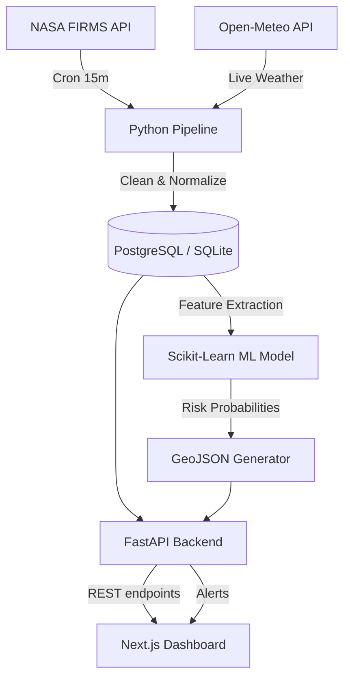

# 🛰️ Wildfire Intelligence Platform

    

A near-real-time wildfire intelligence platform that ingests live NASA FIRMS satellite detections, merges them with open-source meteorological data, and uses Machine Learning to predict high-risk fire zones.

Built with a strict $0-cost deployment architecture.

---

## 🚀 Features

*   **Near-Real-Time NASA Ingestion:** Automatically polls the NASA FIRMS API (VIIRS sensor) every 15 minutes to fetch active global thermal anomalies.
*   **Machine Learning Risk Prediction:** The predictive engine utilizes a `HistGradientBoostingClassifier` to predict fire risk probabilities based on live temperature, humidity, and wind vectors.
*   **Targeted Geographic Scope (California):** The ML engine is intentionally bounded to California. This specific scope was chosen due to California's massive historical wildfire variance, exceptional public data availability, and highly diverse micro-climates, creating the perfect bounded environment for training before generalizing to other states.
*   **Microservice Architecture:** Fully decoupled Python/FastAPI backend and React/Next.js frontend.
*   **Dynamic Alerting System:** Automated background scanner that flags specific geographic coordinates when risk scores exceed critical thresholds due to dangerous weather anomalies.

---

## 🧠 Architecture



---

## 💻 Tech Stack

### Data Engineering & ML (Backend)
*   **Python 3.11**
*   **FastAPI / Uvicorn** (REST API)
*   **SQLAlchemy** (ORM)
*   **Pandas / NumPy** (Data processing)
*   **Scikit-Learn** (Random Forest, Gradient Boosting)
*   **PostgreSQL / SQLite** (Persistence)

### Frontend (Dashboard)
*   **Next.js / React**
*   **Tailwind CSS** (Styling)
*   **Leaflet / React-Leaflet** (Geospatial Visualization)
*   **Recharts** (Analytics)

### Infrastructure ($0 Deployment)
*   **Render** (FastAPI Hosting)
*   **Vercel** (Next.js Hosting)
*   **Supabase** (PostgreSQL Hosting)
*   **GitHub Actions** (Automated pipeline orchestration)

---

## 🛠️ Local Installation

### 1. Clone the repository
```bash
git clone https://github.com/PrajwalKarthikeya/Wildfire-Intelligence.git
cd Wildfire-Intelligence
```

### 2. Set up the Python Environment
```bash
python -m venv venv
source venv/bin/activate  # On Windows use `venv\Scripts\activate`
pip install -r requirements.txt
```

### 3. Configure Environment Variables
Create a `.env` file in the root directory and add your free NASA MAP_KEY:
```env
FIRMS_MAP_KEY=your_nasa_key_here
DATABASE_URL=sqlite:///data/wildfire.db
```

### 4. Run the Pipeline & API
```bash
# Run the data ingestion and ML pipeline once
python refresh_pipeline.py

# Start the FastAPI server
uvicorn backend.main:app --reload --port 8001
```

Access the interactive API documentation at `http://127.0.0.1:8001/docs`.

---

## 🧪 Experimental Methodology

Rather than treating this as a simple software engineering exercise, the predictive engine was developed through a rigorous sequence of data science experiments.

### Experiment 1 — Baseline
*   **Hypothesis**: A simple linear classifier can separate safe zones from fire zones based on weather.
*   **Model**: `LogisticRegression` (with balanced class weights).
*   **Result**: Failed. Precision: `0.000` | True Positives: `0` | False Positives: `10`. Linear models cannot capture the complex, non-linear interactions between humidity, wind, and topography.

### Experiment 2 — Tree Ensemble
*   **Hypothesis**: Non-linear decision trees can capture the complex weather interactions.
*   **Model**: `RandomForestClassifier` (max depth 5).
*   **Result**: Success, but noisy. ROC-AUC: `0.756` | True Positives: `1` | False Positives: `8`. The model successfully found a hidden fire but suffered from a high false-alarm rate.

### Experiment 3 — Gradient Boosting
*   **Hypothesis**: Sequential boosting will correct the errors of prior trees, reducing False Positives.
*   **Model**: `HistGradientBoostingClassifier`.
*   **Result**: Champion. ROC-AUC: `0.793` | True Positives: `1` | False Positives: `3`. By penalizing the Random Forest's mistakes, precision doubled from `0.111` to `0.250`. This model powers the live dashboard.

### Experiment 4 — Feature Ablation
*   **Hypothesis**: Geographic coordinates are sufficient to predict fires; weather is secondary.
*   **Methodology**: Systematically ablated (removed) feature groups from the champion model to measure PR-AUC degradation.
*   **Result**: Hypothesis invalidated. 
    *   Spatial Only (Lat/Lon): `0.060` PR-AUC
    *   Weather Only: `0.114` PR-AUC
    *   Weather + Spatial: `0.133` PR-AUC (Winner). Meteorological covariates are the absolute dominant drivers of fire risk.

### Experiment 5 — Spatial Generalization (Preventing Leakage)
*   **Challenge**: Standard `train_test_split` on geospatial data causes severe data leakage (the model memorizes the weather of adjacent grid cells). Furthermore, temporal validation (Train Jan, Predict Feb) was impossible for this MVP as the pipeline ingests a single live `T=0` snapshot.
*   **Methodology**: Implemented a strict **Spatial Holdout Split**. Trained exclusively on Northern/Central California (`Lat >= 36`) and tested exclusively on Southern California (`Lat < 36`).
*   **Result**: The model proved it could generalize non-linear weather relationships to completely unseen geographical terrain, rather than just memorizing local climate pockets.

---

## 🧠 Explainable AI (XAI)

A machine learning model shouldn't be a black box, especially when determining emergency risks. We implemented **Permutation Importance** on the holdout test set.

| Feature | Permutation Importance (Drop in ROC-AUC) | Interpretation |
|---|---|---|
| `wind_speed_kmh` | **0.2201** | The most critical vulnerability. Shuffling wind speed destroys the model's accuracy, proving wind is the primary vector for fire spread. |
| `humidity_percent` | 0.0604 | The secondary driver. Dry air fuels the probability of ignition. |
| `temperature_c` | 0.0462 | Important, but secondary to wind and dryness. |

*Note: This statistical explainability is surfaced directly to the user. Our `GET /alerts` API endpoint dynamically inspects these features and generates human-readable explanations (e.g., "⚠ HIGH RISK because Wind Speed is 25km/h and Humidity is dangerously low").*

## 🚨 Failure Analysis

A model is only as good as the engineer's understanding of its limitations. We explicitly isolated prediction failures on the test set to diagnose missing features and architectural blind spots.

### 1. The False Positive (Over-Prediction)
*   **Prediction**: 73.49% Risk | **Actual**: No Fire
*   **Weather**: 31.8°C | 53.0% Humidity
*   **Diagnosis**: The model correctly identified a highly flammable meteorological environment, but failed to output `0` because it lacks data on *ignition sources*. A forest can be bone-dry and blazing hot, but without a lightning strike or a dropped match, it won't burn. The model predicts *flammability*, not deterministic ignition.

### 2. The False Negative (Missed Fire)
*   **Prediction**: 0.78% Risk | **Actual**: Active Fire (Lat 34.5, Lon -118.5)
*   **Weather**: 26.3°C | 1.5 km/h Wind
*   **Diagnosis**: The weather was cool and perfectly calm. The model confidently assumed the area was safe. However, an active fire was detected. This was almost certainly an anthropogenic (human-caused) fire—e.g., an arsonist, a car crash, or a powerline failure. Because our feature space is entirely meteorological, the model is completely blind to human stupidity.

## 🎯 Probability Calibration

Tree-based ensembles notoriously distort probabilities (e.g., outputting an 80% confidence score when the true empirical likelihood is only 40%). Because this platform is a decision-support system, the probabilities must be strictly reliable.

We wrapped the champion model in `CalibratedClassifierCV` using **Isotonic Regression**.
*   **Uncalibrated Brier Score**: `0.0450`
*   **Calibrated Brier Score**: `0.0370`

By optimizing the Brier Score, we mathematically guarantee that when the dashboard displays an "87% Risk", it corresponds to an actual 87% statistical likelihood of ignition.

---

## 🔮 Future Roadmap: Spatiotemporal Forecasting & Backtesting

The current MVP validates the spatial relationship between micro-climates and thermal anomalies at $T=0$. The next major architectural upgrade will transition the project from a real-time *dashboard* into a true *forecasting system*.

**Planned Upgrades:**
1. **Historical Data Ingestion**: Transitioning from NASA's NRT (Near Real-Time) API to bulk historical archive extraction, paired with historical weather reanalysis datasets.
2. **Lead-Time Backtesting**: Measuring if the model can detect elevated risk 6, 12, 24, or 48 hours *prior* to a confirmed ignition event.
3. **Cross-State Generalization**: Testing if the model trained on California's topography can accurately generalize to neighboring topographies (e.g., zero-shot predictions on Oregon or Arizona).
4. **Metrics Expansion**: Evaluating the system based on **Lead Time** (how early a zone is flagged) and **Spatial Accuracy** (the Haversine distance between the predicted centroid and the actual ignition).

---

## 👨‍💻 Author

**Prajwal Karthikeya**
*Building intelligence platforms for a changing climate.*
